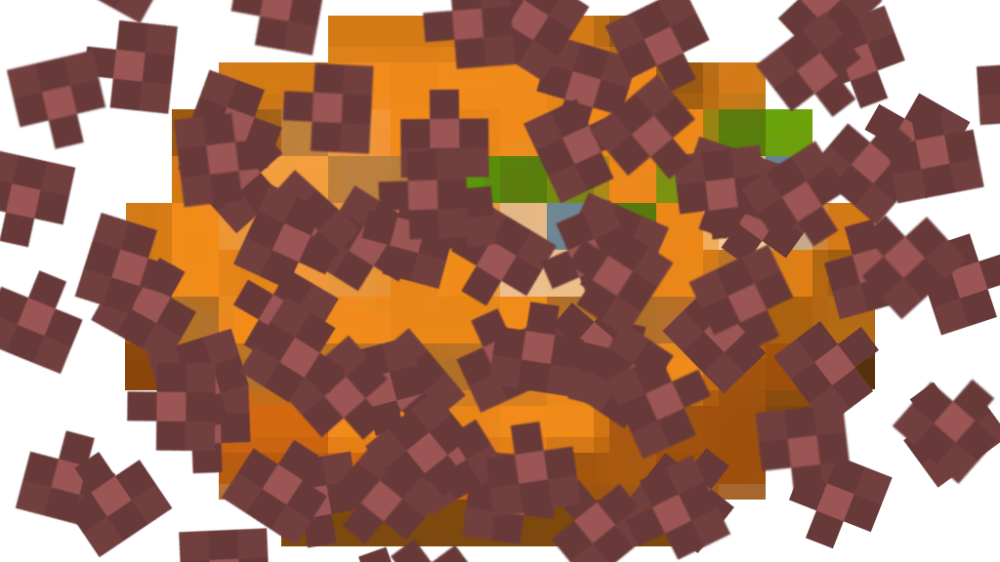

# Tick Happy Mod

[中文指南](README_ZH.md)

[GitHub](https://github.com/CNCUMC/Tick-Happy-Mod) | [NexusMods](https://www.nexusmods.com/scavprototype/mods/420)

If it detects specific (configurable) mod installed, the game crashes.

_Inspired by [Bat Happy Mod](https://www.curseforge.com/minecraft/mc-mods/bat-happy-mod) for Minecraft by Snownee & forestbat121._

---

## Features

| Feature                      | Description                                                                                                   |
|------------------------------|---------------------------------------------------------------------------------------------------------------|
| **Ban Mods**                 | Configure a list of mod GUIDs. Players who have any of them installed are kicked from the server.             |
| **Require THM**              | Optionally force all players to have Tick Happy Mod installed. Players without it are kicked after a timeout. |
| **Single-Player Self-Check** | In single-player, the game quits immediately if a banned mod is detected locally.                             |
| **Multiplayer Notification** | Kicked players see the reason in the KrokoshaMP alert popup.                                                  |

## Installation

1. Install [BepInEx 5.x](https://github.com/BepInEx/BepInEx) for Casualties Unknown.
2. Install [KrokoshaCasualtiesMP](https://github.com/Krokosha/CasualtiesMP) (required for multiplayer features).
3. Place `TickHappyMod.dll` into `BepInEx/plugins/Tick Happy Mod/`.
4. Configure `BepInEx/config/org.cncumc.tickhappymod.cfg`.

## Configuration

```ini
[Tick Happy Mod]

## Comma/space/semicolon/etc separated list of mod GUIDs to ban.
# Setting type: String
# Default value: 
ban_mods =

## When true, the server kicks any player who does NOT have THM installed.
# Setting type: Boolean
# Default value: false
require_thm = false

## Timeout in seconds before kicking a player who hasn't reported their mod list.
# Setting type: Single
# Default value: 15
report_timeout = 15
```

### Example

```ini
ban_mods = net.cucorelib, CUAdvancedBossBar
require_thm = true
```

With this config, players connecting to the server must have Tick Happy Mod installed and must NOT have `net.cucorelib`
or `CUAdvancedBossBar`.

## How It Works

### Single-Player

- `Awake()` checks `Chainloader.PluginInfos` against `BanModsList`.
- If a banned mod is found locally → logs it → `Application.Quit()`.

### Multiplayer (Server)

1. Handler is injected into KrokoshaMP's `SERVER_MESSAGE_HANDLERS` dictionary via reflection.
2. When a client joins (`NetPlayer.OnPlayerJoined`), the server starts a timeout timer.
3. The client (if THM is installed) sends its full mod list via `Net.Client_Send`.
4. The server checks the client's mods against `BanModsList`.
5. If banned mods are found → `Server_DoAlertSingle` popup + `Net.Server_Kick`.
6. If `require_thm` is true and no report arrives within `report_timeout` seconds → built-in KrokoshaMP alert + kick.

### Multiplayer (Client)

- On `OnPlayerJoined` with `is_local`, sends `Chainloader.PluginInfos.Keys` to the server.
- No server-side mod needed for basic compatibility; only THM-equipped clients report their mods.

## Development

- **Target Framework:** .NET Framework 4.8
- **Dependencies:** BepInEx 5, HarmonyLib, KrokoshaCasualtiesMP, LiteNetLib
- **Build:** `dotnet build`

### Project Structure

```
Tick-Happy-Mod/
├── Plugin.cs                  # Main plugin logic
├── TickHappyMod.csproj        # Project file
├── Directory.Build.props      # Shared build properties (game path)
├── README.md / README_ZH.md   # Documentation
└── CHANGELOG.md / CHANGELOG_ZH.md
```

## License

[GPL v3](LICENSE.md)
